  

  

**The research tile of HYDRA-130: one question, on as little silicon as it
takes to answer it.** Can a hardware scheduler predict how long work will take
on five different engines, choose the cheapest, then *measure what actually
happened* and correct its own model, with no firmware in the loop?

Give it a unit of work — a matrix multiply, a vector operation, a polynomial
transform — and it costs each of five compute engines with a roofline model,
picks the cheapest, and when the work completes, moves a per-engine,
per-operation factor toward the truth.

This repository is the **experiment**, not the product. The full chip, with
the CPU, GPU and TPU this dispatcher schedules, is
[hydra-skywater130](https://github.com/Normansrule/hydra-skywater130). The
two share the dispatcher's cost model, scoreboard and calibration modules
file for file; everything else here was cut to the experiment.

## What v3 cut, and why

| | v2 (4×4, signed off) | v3, this tile |
|---|---|---|
| Tiles | 16 | **12**, a quarter off the tile cost |
| Cells, yosys + abc on sky130 | 15,574 | **11,964** |
| Cell area | 147,278 µm² | **113,939 µm²** |
| Host interfaces | v1 serial pins **and** SPI, strapped at reset | SPI only |
| Tags in flight | 8 | 4 |
| Descriptor readback (LASTWD) | yes | no |
| Tests | 17 | 18 |

- **The serial pins went.** v1's protocol shifted the 128-bit descriptor in
  one bit per clock, through a shift register that toggled on every shift.
  The register map sees everything the pins could, and more: the full 32-bit
  margin, live parameter retuning, calibration counters.
- **The descriptor readback went.** Reading back the descriptor as dispatched
  kept all 128 of its bits alive through every pipeline stage, only to be
  observed: 12,600 µm², a tenth of the tile, to echo what the host just sent.
  On the chip the descriptor travels on to an engine, so the chip keeps it.
- **Four tags, not eight.** The scoreboard is the largest block. Four in
  flight still exercise exhaustion, back-pressure and out-of-order completion.

Nothing in the cost model, the calibration loop or the decision changed. The
same descriptors choose the same engines.

| | |
|---|---|
| **Engines it chooses between** | scalar CPU · SIMD vector unit · 4×4 INT8 systolic array · number-theoretic transform · crypto datapath |
| **Cost model** | roofline: compute time vs memory time per engine, plus queue depth and an energy term |
| **Calibration** | every completion reports its real duration; a per-engine, per-operation factor moves toward the truth |
| **Decision latency** | about 13 cycles — one shared cost engine evaluates all five in turn |
| **Interface** | SPI register map, mode 0, three pins; status summaries on the outputs |
| **Clock** | 15.15 MHz (66 ns) |
| **Tiles** | 3 × 4 |

## Pinout

## Inside

**One cost engine doing the work of five.** The five engines differ only in
their parameters, so a single engine walked over the five parameter rows
computes the same costs in more cycles and about a fifth of the area — the
change that took this tile from failing placement at 98.8% density to a
clean harden. Two cycles per engine, not one: the engine's second stage reads
the calibration factor, an input, so each engine's inputs are held across
both cycles. The parent repository proves the shared version makes **the same
decision** as the parallel one on every descriptor it is given.

## Status

**v3 is not hardened yet.** Its 3×4 utilisation is an estimate, about 70%,
from v2's ratio of LibreLane area to synthesis area; `src/config.json` raises
the placement density target to 70 to match. If the harden fails placement or
routing, `tiles` in `info.yaml` goes back to `"4x4"` — one line — and the cuts
still save the power.

The last signed-off harden is v2's, the same cost model with the parts above
still in it:

*v2's real layout: every standard cell and wire, rendered from the hardened
GDS by Tiny Tapeout's own tool (`./tt/tt_tool.py --create-png`).*

| v2 check, 2026-10-05 | result |
|---|---|
| Hardening, all 80 stages | **complete** |
| Layout versus schematic | **match** — 18,773 devices, 18,637 nets |
| Design rule check (Magic) | **clean** |
| Setup timing at 66 ns | **met at all nine corners** — slow corner slack **+2.20 ns** |
| Hold timing | **met at all nine corners** |
| Antenna | **clean** — six repair passes cleared the last net |
| Utilisation | **67.3%** of the 4×4 tile |
| Gate-level simulation | **17 / 17** on the hardened netlist (2026-10-07) |

| v3 check | result |
|---|---|
| Tile tests, RTL | **18 / 18** |
| Deliberate breaks caught (`test/mutate_sim.py`) | **15 / 15**, each by the test named for it |
| Harden, gate level | pending |

## How to test

With the Tiny Tapeout demo board, select `tt_um_hydra_mom` and drive SPI on
`ui[0]` (SCK), `ui[1]` (COPI) and `ui[2]` (CSn). Write the descriptor to
register `0x01`, write `0x01` to `0x03` (GO), read the result from `0x06`.
[`docs/info.md`](docs/info.md) has the register map and a worked example.
Software written for v2's register personality works unchanged: v3 ignores
the reset strap. Only the ID (`HYM3`), the tag count and the missing LASTWD
register differ.

## Part of HYDRA-130

This tile is the **dispatcher** from a larger chip. Everything below lives in
[hydra-skywater130](https://github.com/Normansrule/hydra-skywater130) — on the
full sky130 design and the FPGA images, **not on this tile**:

- a 4×4 INT8 systolic array and a 4-lane 32-bit vector unit, both fed from memory
- a number-theoretic transform engine at the ML-KEM, ML-DSA and Falcon moduli
- a root of trust after Caliptra's discipline: key vault (proved never to leak), mailbox (proved mutually exclusive), SHA-256, extend-only measurement register
- RISC-V security instructions: ratified Zknh plus a custom extension with no key-read instruction
- an IEEE 1149.1 test port beside the serial bridge — two independent ways in
- the dispatcher in full: both host interfaces, eight tags, the descriptor readback

## Verification

The tile's tests run from the pins only. The parent repository holds the
engines, the proofs and the rest of the chip: the dispatcher's decision
equivalence, formal proofs of every port contract, mutation testing of every
bench, and independent models for each engine. Its `make verify` also checks
that the modules this tile shares with the chip are byte-identical, so the
chip's verification of them covers this tile too.

Apache 2.0. Fabricated through [Tiny Tapeout](https://tinytapeout.com) on the
SkyWater sky130 process.
