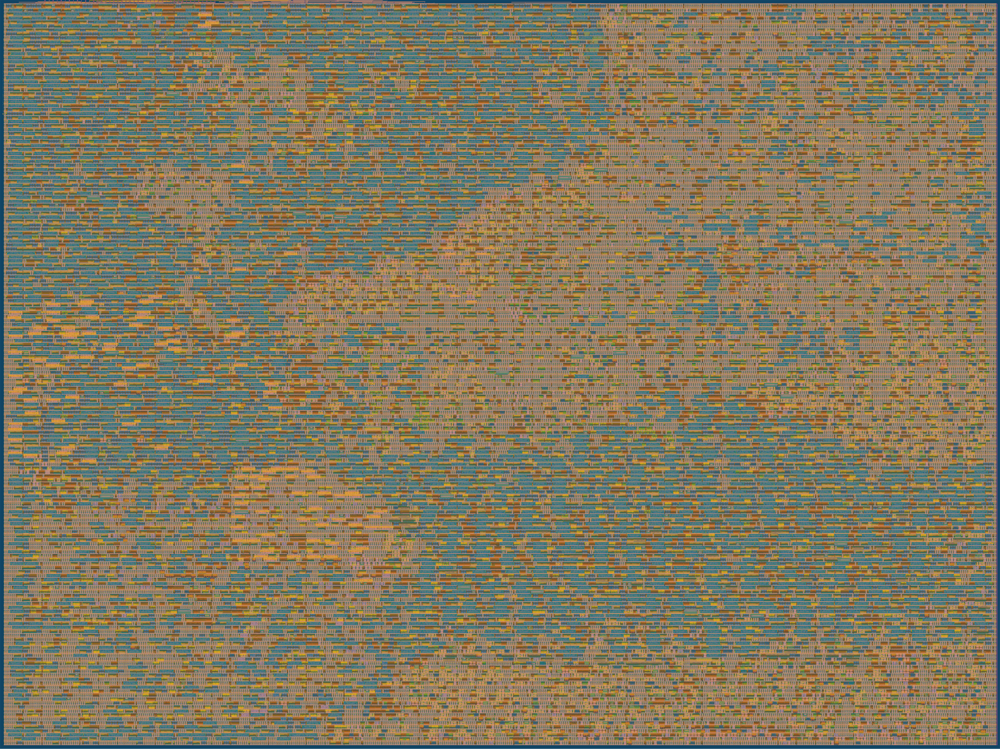
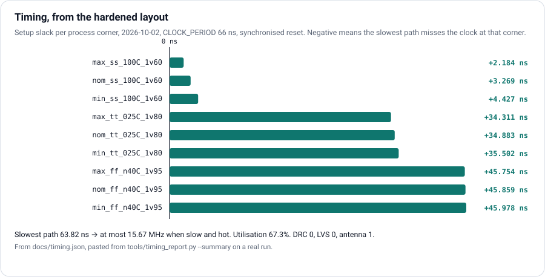

  

# HYDRA-130 · a dispatcher that measures its own engines

**A hardware scheduler in 4×4 Tiny Tapeout tiles.** Give it a unit of work — a
matrix multiply, a vector operation, a polynomial transform — and it predicts
how long each of five compute engines would take, sends the work to the
cheapest, then *measures what actually happened* and corrects its own model.
No firmware in the loop: the prediction, the choice and the correction are
all hardware.

*The real layout: every standard cell and wire in the tile, rendered from the
hardened GDS by Tiny Tapeout's own tool (`./tt/tt_tool.py --create-png`).*

| | |
|---|---|
| **Engines it chooses between** | scalar CPU · SIMD vector unit · 4×4 INT8 systolic array · number-theoretic transform · crypto datapath |
| **Cost model** | roofline: compute time vs memory time per engine, plus queue depth and an energy term |
| **Calibration** | every completion reports its real duration; a per-engine factor moves toward the truth |
| **Decision latency** | about 13 cycles — one shared cost engine evaluates all five in turn |
| **Interfaces** | two personalities, strapped at reset: the v1 serial pins, or an SPI register map |
| **Clock** | 15.15 MHz (66 ns) — every corner meets setup; slow-corner slack +2.18 ns |
| **Area** | 144,505 µm² of standard cells by synthesis, 26% smaller than five parallel engines |
| **Tiles** | 4 × 4 |

## Pinout

## Inside

**One cost engine doing the work of five.** The five engines differ only in
their parameters, so a single engine walked over the five parameter rows
computes the same costs in more cycles and about a fifth of the area — the
change that took this tile from failing placement at 98.8% density to a
clean harden. Two cycles per engine, not one: the engine's second stage reads
the calibration factor, an input, so each engine's inputs are held across
both cycles. The parent repository proves the shared version makes **the same
decision** as the parallel one on every descriptor it is given.

## Status

| check | result |
|---|---|
| Hardening, all 80 stages | **complete** |
| Layout versus schematic | **match** — 18,773 devices, 18,637 nets |
| Design rule check (Magic) | **clean** |
| Setup timing at 66 ns | **met at all nine corners** — slow corner +2.184 ns |
| Hold timing | **met at all nine corners** |
| Antenna | **1 net** left after three repair passes; config now runs six — re-harden pending |
| Utilisation | **67.3%** of the 4×4 tile |
| Tile tests, RTL | 17 / 17 |

Honest reading: timing is closed. What closed it was releasing the reset
through a synchroniser, not a longer clock — the same 66 ns failed without it.
One antenna net is the last sign-off item.

## How to test

With the Tiny Tapeout demo board, select `tt_um_hydra_mom`. Strap `ui[7:4] =
0xA` during reset for the register personality, or leave it for the serial
one. `docs/info.md` has the full protocol and a worked example.

## Part of HYDRA-130

This tile is the **dispatcher** from a larger chip. Everything below lives in
[hydra-skywater130](https://github.com/Normansrule/hydra-skywater130) — on the
full sky130 design and the FPGA images, **not on this tile**:

- a 4×4 INT8 systolic array and a 4-lane 32-bit vector unit, both fed from memory
- a number-theoretic transform engine at the ML-KEM, ML-DSA and Falcon moduli
- a root of trust after Caliptra's discipline: key vault (proved never to leak), mailbox (proved mutually exclusive), SHA-256, extend-only measurement register
- RISC-V security instructions: ratified Zknh plus a custom extension with no key-read instruction
- an IEEE 1149.1 test port beside the serial bridge — two independent ways in

## Verification

The tile's tests run from the pins only, in both personalities. The parent
repository, [hydra-skywater130](https://github.com/Normansrule/hydra-skywater130),
holds the engines, the proofs and the rest of the chip: the dispatcher's
decision equivalence, formal proofs of every port contract, mutation testing
of every bench, and independent models for each engine.

Apache 2.0. Fabricated through [Tiny Tapeout](https://tinytapeout.com) on the
SkyWater sky130 process.
